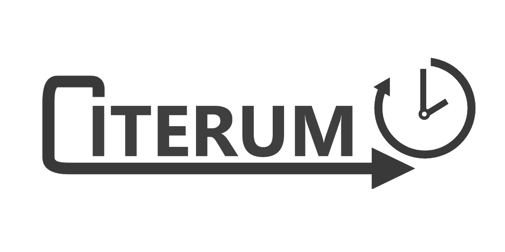
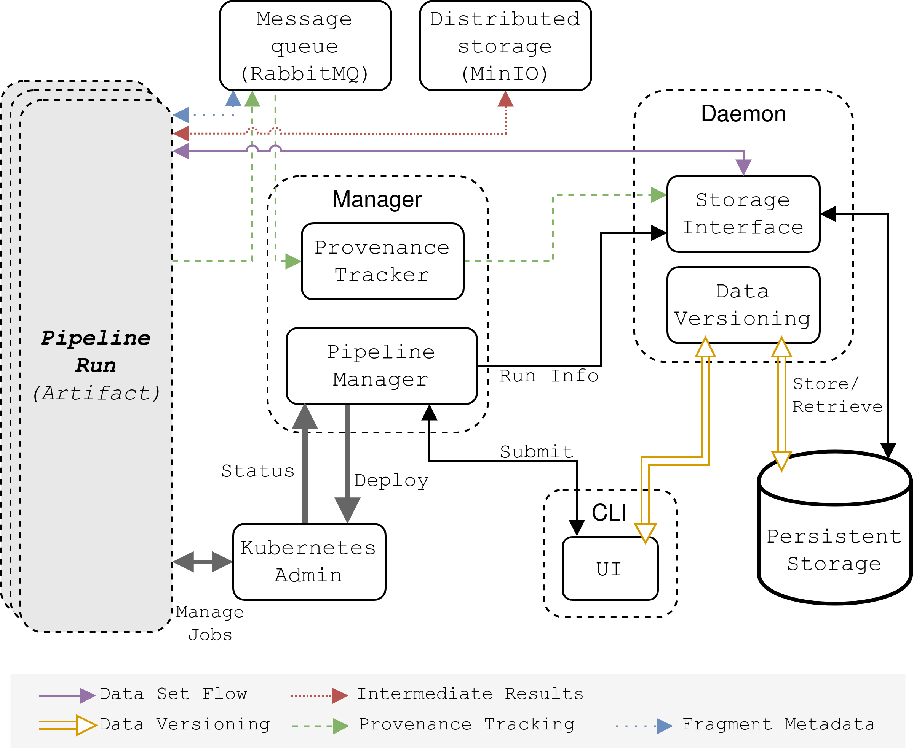
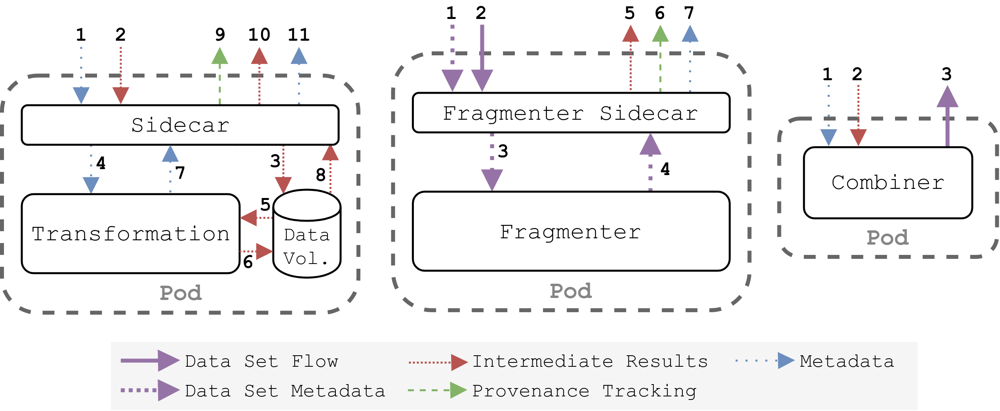

# The Iterum framework

Iterum is a framework which assists users in tracking the provenance of data in data science pipelines. The framework is designed in such a way that it can track versions of data sets, source code, configurations of their pipelines and evolution of data throughout an experiment. This proof-of-concept framework is derived from the research and architecture described in the master theses [[1]](#1) and [[2]](#1), which are included in this repository in the *documents* folder.

Iterum consists of a couple of different features, most notably:
* Keep track of changes in data, code and pipelines
* Deploy and run pipelines
    * Both distributed and localized
* Be agnostic towards the experiment
* Automate as many things for the user as possible

This repository gives a short overview of the architecture of the framework, and how this architecture maps to repositories/source code.

## Quick start
### 1. Set up the Iterum cluster
Follow the instructions in the [cluster setup](https://github.com/iterum-provenance/cluster) repository.
### 2. Install the CLI
Follow the instructions in the [CLI](https://github.com/iterum-provenance/cli) repository.
### 3. Run the demo pipeline
Follow the instructions in the [demo pipeline](https://github.com/iterum-provenance/demo) repository.

## Quick overview of the architecture
The architecture of iterum has a infrastructural part, but also some components which are only active during a pipeline. The names of the software artifacts link to their respective repository. The general idea of how these components function is described in their respective repository readmes. How these components interact is described in greater detail in [[1]](#1) and [[2]](#1).

### Infrastructural components
The following image shows the infrastructural components of the framework:

It consists of a couple of different components, some of which are combined into a single software artifacts.

* [Daemon](https://github.com/iterum-provenance/daemon) (combines: storage interface, data versioning)
* [Manager](https://github.com/iterum-provenance/manager) (combines: provenance tracker, cluster manager)
* [CLI](https://github.com/iterum-provenance/cli)

And some off-the-shelf artifacts:
* Message queing system (RabbitMQ)
* Distributed storage (MinIO)

### Ephemeral components
The following image shows the ephemeral components of the framework, which started for each pipeline which is deployed:

The ephemeral components consist of a user-provided *transformation* step and a user-provided *fragmenter*. These differ between specific pipelines, and are therefore not part of the Iterum codebase itself.
Iterum provides sidecars which communicate with these user-provided components:
* [Fragmenter sidecar](https://github.com/iterum-provenance/fragmenter-sidecar)
* [Sidecar](https://github.com/iterum-provenance/sidecar)
* [Combiner](https://github.com/iterum-provenance/combiner)

## Repository overview
Iterum consists of a couple of different repositories. These repositories contain the source code for the Iterum framework itself:
* [Daemon](https://github.com/iterum-provenance/daemon)
    Combines functionality of the data versioning server and storage interface in one software artifact
* [Manager](https://github.com/iterum-provenance/manager) 
    Combines functionality of the pipeline manager and provenance tracker in one software artifact
* [Iterum-Rust](https://github.com/iterum-provenance/iterum-rust) 
    Common functionality between the Rust software artifacts
* [Fragmenter sidecar](https://github.com/iterum-provenance/fragmenter-sidecar)
    Sidecar source code, for communication between the user-provided fragmenter, and the rest of the framework
* [Sidecar](https://github.com/iterum-provenance/sidecar)
    Sidecar source code, for communication between the user-provided transformation step, and the rest of the framework
* [Combiner](https://github.com/iterum-provenance/combiner)
    Combiner source code, used to convert a fragment stream to a batch of data
* [Iterum-Go](https://github.com/iterum-provenance/iterum-go)
    Common functionality between the Go software artifacts
* [CLI](https://github.com/iterum-provenance/cli)
    Implemented user interface to interact with the different software artifacts present in Iterum

Some auxilliary repositories, supporting Iterum:
* [Cluster setup](https://github.com/iterum-provenance/cluster)
    Contains Kubernetes deployment files which help the user to set up Iterum on a Kubernetes cluster
* [Libraries](https://github.com/iterum-provenance/libraries)
    Overarching repository containing client libraries which help users to create their transformation steps and fragmenters.
* [Pyterum](https://github.com/iterum-provenance/pyterum)
    One of the client libraries implemented for Python.
* [Demo pipeline](https://github.com/iterum-provenance/demo)
    Contains a demonstration pipeline, which functions as an example of how a user can use Iterum. This pipeline detects the eyes of cats in images using edge detection and Hough transforms.

## References
<a id="1">[1]</a> Apperloo, E. (July, 2020). 
Provide provenance and reproducibility of pipeline executions by tracking provenance of pipeline definitions and their code
(Master thesis, Rijksuniversiteit Groningen)

<a id="2">[2]</a> Timmerman, M. (July, 2020). 
Enabling reproducibility and provenance of results by tracking the evolution of data in (data science) pipelines
(Master thesis, Rijksuniversiteit Groningen)
